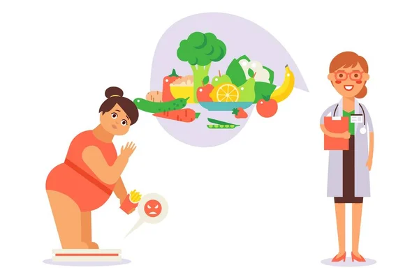

<h1 align="center">
  
</h1>

<h1 style=color:pink;> Projeto Final Turma On26 Python <h1>

### Obesidade em Perspectiva: Explorando Causas e Soluções por meios de dados.

Neste projeto, exploramos a relação entre obesidade e estilo de vida. A obesidade, um desafio global crescente, refere-se ao excesso de gordura corporal e está intimamente ligada a complicações de saúde como diabetes, problemas cardíacos, hipertensão e certos tipos de câncer. Indivíduos que lidam com a obesidade muitas vezes enfrentam preconceitos e e discriminação sociais o famoso Bullying, afetando sua autoestima, saúde mental e oportunidades de emprego.

A obesidade não só impacta a qualidade de vida,como ela gera problemas de mobilidade, dores nas articulações, dificuldades respiratórias e limitações nas atividades diárias, mas suas causas são diversas, envolvendo uma complexa interação entre fatores genéticos, ambientais, sociais e comportamentais."

O estilo de vida moderno, caracterizado por dietas pouco saudáveis e baixa atividade física, é um fator significativo no aumento das taxas de obesidade global. Além disso, fatores socioeconômicos, acesso limitado a alimentos saudáveis e ambientes urbanos desencorajadores para atividades físicas também desempenham papéis cruciais nesse cenário.

Pequenas mudanças no dia a dia podem fazer grande diferença no controle do peso. Incluir mais frutas e vegetais na alimentação, praticar caminhadas regulares e optar por água em vez de refrigerantes são passos simples que podem contribuir para a redução da obesidade. Controlar as porções de comida e garantir um sono adequado são outras ações simples que podem promover um estilo de vida mais saudável e auxiliar no controle do peso, promovendo a saúde e o bem-estar em âmbito global.

Ao considerarmos as bases de dados sobre obesidade, é importante notar que indivíduos obesos frequentemente enfrentam enfrentam preconceitos e e discriminação sociais,esses comportamentos podem resultar em efeitos psicológicos adversos, como baixa autoestima,oportunidades de emprego,vida afetiva, depressão e ansiedade.

Nesse projeto Investigei o recorte de gênero, Filtração os tipos de Obesidades com o índice de massa corporal (IMC) acima de 30 e a prática de atividade física, Analise da faixa etária em adolecentes.

### Fontes:

 Base 1 - https://www.kaggle.com/datasets/sujithmandala/obesity-classification-dataset

 Base 2 - https://www.kaggle.com/datasets/utkarshx27/obesity-among-children-by-selected-characteristics

 Base 3 - https://www.kaggle.com/code/mpwolke/obesity-levels-life-style

### Ferramentas 

 Análise exploratória adotará o uso da linguagem de programação `Python`, para manipulação dos dados (limpeza e tratamento dos dados, análise exploratória dos dados) as bibliotecas `Pandas` e `Matplotlib`. Para análise visual usaremos a ferramenta `Tableau`,
 

📌 Este projeto está com visualizações públicas no Tableau. Você pode acessar no link [Tableau](https://public.tableau.com/authoring/ProjetoFinal_17017391304910/).

 

<h1 align="center">
  
</h1>

<footer>

 
 <strong> <a  style = color: purple; class="s2">❤</a> Desenvolvido pela aluna Márcia Tadakuma {Reprograma} <a style = color: purple;  class="s2">❤</a>  | ©  2023 </strong>

 
</footer>

